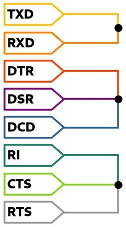

# goSerialPort : Embedded Serial port Package

Package `goSerialPort` is **Embedded** focused serial port package.
It helps to read, write and configure the serial port.

This project draws inspiration from 
- [`github.com/tarm/serial`](https://github.com/tarm/serial)
- [`github.com/johnlauer/goserial`](http://github.com/johnlauer/goserial)
- [`go.bug.st/serial`](https://github.com/bugst/go-serial)

This project aims to provide low level API and compatibility for *Windows* and *Linux*.
As time progresses other OS and architectures would be added.

This library perform read / write in *Non-Blocking Manner*.

By default this package uses 8 bits (byte) data format for exchange.
This is typical for **Embedded Applications** such as `UART` of an MCU.

Note: Baud rates are defined as OS specifics

Currently Following Features are supported:

 1. All types of BAUD rates
 2. Flow Control - Hardware, Software (XON/XOFF)
 3. RTS , DTR control
 4. CTS , DSR, RING read back
 5. Parity Control - Odd, Even, Mark, Space
 6. Stop Bit Control - 1 bit and 2 bits
 7. Hardware to Software Signal Inversion for all Signals RTS, CTS, DTR, DSR, RI
 8. Sending Break from TX line
 X. ... More on the way ...

## Install

```
go get -u github.com/boseji/goSerialPort
```

You can cross compile with 
```
GOOS=windows GOARCH=386 go install github.com/boseji/goSerialPort
```
Specifically for Window7 on *i386* or 32-bit.

## Hardware Test Setup

Use a USB to UART board where all the *UART standard signals* are exposed.

Here is a picture explaining the Connections:



## License

```
Copyright 2021 Abhijit Bose. All rights reserved.

Licensed under the Apache License, Version 2.0 (the "License");
you may not use this file except in compliance with the License.
You may obtain a copy of the License at

    http://www.apache.org/licenses/LICENSE-2.0

Unless required by applicable law or agreed to in writing, software
distributed under the License is distributed on an "AS IS" BASIS,
WITHOUT WARRANTIES OR CONDITIONS OF ANY KIND, either express or implied.
See the License for the specific language governing permissions and
limitations under the License.
```

SPDX-License-Identifier: Apache-2.0